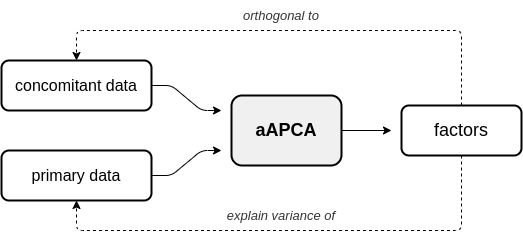

# Augmented Principal Component Analysis


## Overview

This library provides Python implementation of Augmented Principal Component Analysis (Augmented PCA or APCA) - a family of linear factor models that find a set of factors according to an *augmenting objective* in addition to the canonical PCA objective of finding factors that maximize the explained data variance. APCA can be split into two general families of models: adversarial APCA and supervised APCA.


### Adversarial APCA

In adversarial APCA (aAPCA), the augmenting objective is to make the factors *orthogonal* to a set of concomitant data, in addition to having the factors explain the variance of the original observed or primary data. Below is a diagram depicting the relationship between primary data, concomitant data, and the resulting aAPCA factors.




### Supervised APCA

In supervised APCA (sAPCA), the augmenting objective is to make the factors *aligned* with the data labels, or some outcome, in addition to having the factors explain the variance of the original observed or primary data. Below is a diagram depicting the relationship between primary data, supervision data, and the resulting sAPCA factors.


## Documentation

Documentation for APCA is available on this [documentation site]().

Provided documentation includes:

* Motivation - Motivation behind the APCA model and the different approximate inference strategies.

* Model formulation - Overview of different models and approximate inference strategies as well as more in-depth mathematical descriptions.

* Tutorials - Step-by-step guide on how to use the different offered APCA model.

* Examples - Use case examples for the different models.


## Dependencies

The APCA library is written in [Python](https://www.python.org/), and requires Python >= 3.6 to run. APCA relies on the following libraries and version numbers:

* Python >= 3.6
* NumPy >= 1.19.2
* SciPy >= 1.5.2


## Installation

To install the latest stable release, use [pip](https://pip.pypa.io/en/stable/reference/pip_install/). Use the following command to install:

    $ pip install augmented-pca


## Issue Tracking and Reports

Please use the [Github issue tracker](https://github.com/wecarsoniv/augmented-pca/issues) associated with the APCA repository for issue tracking, filing bug reports, and asking general questions about the library or project.


## Quick Introduction

A quick guide to using APCA is given in this section. For a more in-depth guide, see our [documentation]().

### Importing APCA and Instantiating Models

APCA models can be imported from the `models.py` module or by importing the models themselves from the `models.py` module. 

```python
# Import all APCA models
from apca.models import *

```


### Instantiating APCA

APCA models are instantiated by assigning either an aAPCA or sAPCA object to a variable. During instantiation, one has the option to define parameters `n_components`, `mu`, which represent the number of components and the augmenting objective strength, respectively. Additionally, approximate inference strategy can be defined through the `inference` parameter.

```python
# Define model parameters
n_components = 2        # factors will have dimensionality of 2
mu = 1.0                # augmenting objective strength equal to 1 
inference = 'encoded'   # encoded approximate inference strategy

# Instantiate adversarial APCA model
aapca = aAPCA(n_components=n_components, mu=mu, inference=inference)

```


### Fitting APCA

APCA models closely follow the style and implemention of [scikit-learn's PCA implementation](https://scikit-learn.org/stable/modules/generated/sklearn.decomposition.PCA.html), with many of the same methods and functionality. Similar to scikit-learn models, APCA models are fit using the `fit()` method. `fit()` takes two parameters: `X` which represents the matrix of primary data and `Y` which represents the matrix of augmenting data.

```python
# Import numpy
import numpy as np

# Generate synthetic data
# Note: primary and augmenting data must have same number of samples/same first dimension size
n_samp = 100
X = np.random.randn(n_samp, 20)   # primary data, 100 samples with dimensionality of 20
Y = np.random.randn(n_samp, 3)    # concomitant data, 100 samples with dimensionality of 3

# Fit adversarial APCA instance
aapca.fit(X=X, Y=Y)

```

Alternatively, APCA models can be fit using the `fit_transform()` method, which takes the same parameters as the `fit()` method but also returns a matrix of components or scores.

```python
# Fit adversarial APCA instance and generate components
S = aapca.fit_transform(X=X, Y=Y)

```


### Approximate Inference Strategies

In this section, we give a brief overview of the different approximate inference strategies offered for APCA. Inference strategy should be chosen based on the data on which the APCA model will be used as well as the specific use case. Both aAPCA and sAPCA models use the jointly-encoded approximate inference strategy by default.


#### Local

In the local approximate inference strategy, the factors (local variables associated with each observation) are included in both the likelihood relating and the augmenting objective. Below is a diagram of the local inference strategy.


Here, $X$ represents the matrix of primary data, $Y$ represents the matrix of augmenting data, $\theta$ are the loadings, $\mathcal{L}$ is the log-likelihood, and $\mathcal{D}$ is the augmenting objective. Because the local variables are included in the augmenting objective, given new data we must know $\X_{new}$ *and* augmenting data $Y_{new}$ to obtain factors $S_{new}$. Thus, the local inference strategy should only be used for inference on new data when both primary and augmenting data are available. Below we show an example of how to fit a sAPCA model with local approximate inference strategy to training data and obtain factors for test data.

```python
# Import numpy
import numpy as np

# Import supervised APCA
from apca.models import sAPCA

# Generate synthetic data and labels
n_samp = 100
X = np.random.randn(n_samp, 20)
Y = np.random.randint(low=0, high=1, size=(n_samp, 1), dtype=int)

# Generate test/train splits
train_pct = 0.7
idx = np.arange(start=0, stop=101, step=1, dtype=int)
np.random.shuffle(idx)
n_train = int(train_pct * len(idx))
train_idx = idx[:n_train]
test_idx = idx[n_train:]

# Split data into test/train sets
X_train = X[train_idx, :]
X_test = X[test_idx, :]
Y_train = Y[train_idx, :]
Y_test = Y[test_idx, :]

# Instantiate supervised APCA model
sapca = sAPCA(n_components=3, mu=5.0, inference='local')

# Fit supervised APCA model
sapca.fit(X=X_train, Y_train)

# Generate components for test set
S_test = sapca.transform(X=X_test, Y=Y_test)

```


#### Encoded


#### Jointly-Encoded


## Citation

Please cite our paper if you find this library or model helpful in your research:

    @inproceedings{carson_augmentedpca,
    title={Augmented Principal Component Analysis},
    author={{Carson IV}, William E. and Talbot, Austin and Carlson, David},
    year={2021},
    maintitle={Conference},
    booktitle={Workshop}}


## Funding

This project was supported by the NIH BRAIN Initiative, award number R01 EB026937.

