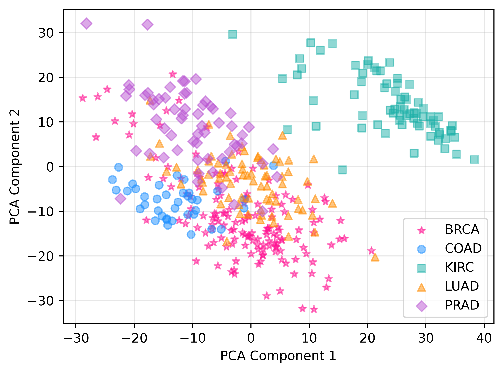
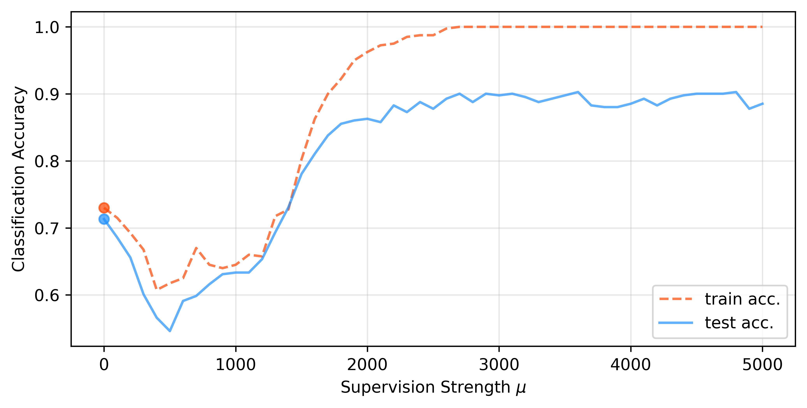
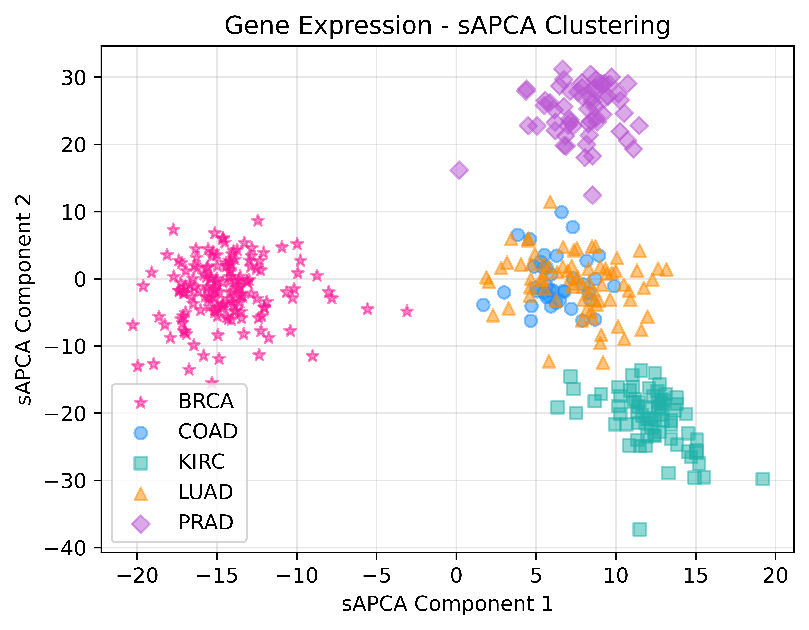

:github_url: https://github.com/wecarsoniv/augmented-pca

.. role:: python(code)
   :language: python

Examples
========================================================================================================================

Here, usage and efficacy of AugmentedPCA models is demonstrated on real world, open-source datasets.

sAPCA Example - Gene Expression Clustering
------------------------------------------------------------------------------------------------------------------------

The ability of sAPCA to create representations with greater class fidelity is demonstrated using a 
`gene expression dataset from the UCI machine learning repository <https://archive.ics.uci.edu/ml/datasets/gene+expression+cancer+RNA-Seq>`_. 
This dataset contains RNA-Seq gene expression samples from patients with five different typesof tumors. Dimensionality 
reduction techniques, such as PCA, are often used in gene expression analysis to visualize clustering of samples in 
2-dimensional(2D) space or as a preprocessing step for downstream classification. However, sometimes principal axes of 
variance may represent patient-specific gene expression variance rather than variance specific to condition or disease. 
Here, sAPCA is used to create representations that, in addition to representing the variance in the gene expression 
data, are aligned with the data labels.

First, Python functions, modules, and libraries used in this example are imported.

.. code-block:: python

    # Import functions, modules, and libraries
    import numpy as np
    from sklearn.preprocessing import LabelEncoder, StandardScaler
    from sklearn.model_selection import train_test_split
    from sklearn.metrics import accuracy_score
    from sklearn.decomposition import PCA
    from sklearn.manifold import TSNE
    from sklearn.linear_model import LogisticRegression
    import matplotlib.pyplot as plt

Next, AugmentedPCA factor models are imported from the :python:`apca.models` module.

.. code-block:: python

    # Import AugmentedPCA models
    from apca.models import *
    

Gene expression data is loaded and formatted into a matrix :python:`X`, where each row represents a different tumor 
gene expression sample and each column represents a different gene. Labels are store in an array and tumor samples are 
assigned an integer label of either 0, 1, 2, 3, or 4. Labels are then one-hot encoded to create a matrix :python:`Y` 
of augmenting supervision data.

.. code-block:: python

    # Display data dimensionality
    print('Cancer gene expression dataset dimensions:')
    print('  Gene expression data:  (%d, %d)' % (X.shape))
    print('  Supervision data:  (%d, %d)' % (Y.shape))
    print('  Labels:  (%d,)' % (y.shape))
    
    >>> Cancer gene expression dataset dimensions:
    >>>   Gene expression data:  (801, 20531)
    >>>   Supervision data:  (801, 5)
    >>>   Labels:  (801,)
    

Instead of using all gene expression data, only a subset of the gene expression data will be used. This is because the 
process of fitting AugmentedPCA models require matrix inversions as well as eigendecompositions. This process gets 
prohibitively expensive for larger feature dimensions. Thus, it is recommended to keep the feature dimensions to around 
~1,000 features, give or take.

Next, scikit-learn's :python:`train_test_split()` function is used to split the data into train and test splits
(roughly 50% and 50% of the data, respectively).

.. code-block:: python

    # Subset of original data
    X_subset = X[:, :2000]

    # Split data
    X_train, X_test, Y_train, Y_test, y_train, y_test = train_test_split(X_subset, Y, y,
                                                                         test_size=0.5,
                                                                         shuffle=True,
                                                                         random_state=0)
    

Gene expression training features are scaled such that each feature has mean zero and unit variance. Then, test data is 
scaled according to the population statistics of the training features. Supervision data isn't scaled since the data is 
one-hot encodings.

.. code-block:: python

    # Instantiate standard scaler
    scaler = StandardScaler()

    # Scale gene expression data
    X_train = scaler.fit_transform(X_train)
    X_test = scaler.transform(X_test)
    

For evaluating the classification performance achieved using AugmentedPCA components, a simple logistic regression 
classifier with no penalty is used, since only two components will be used for prediction.

.. code-block:: python

    # Instantiate logistic regression model
    model = LogisticRegression(penalty='none', solver='lbfgs', max_iter=10000,
                            multi_class='auto', random_state=0)
    

Now, two PCA components of the decomposed gene expression data is used to predict tumor type. Logistic regression only 
achieves 71% accuracy on the test set. This is because PCA finds independent sets  of features (orthogonal components) 
that maximize the explained variance of the data. If the majority of the variance of the gene expression data is not 
aligned with class labels then class separation will not be achieved from the first few principle components. This is 
reflected in the visualization of the 2-dimensional (2D) clustering. There is clear separation of KIRC from the other 
cancers, but the other cancers still have significant overlap.

.. code-block:: python

    # PCA decomposition
    n_components = 2
    pca = PCA(n_components=n_components)
    S_train = pca.fit_transform(X_train)
    S_test = pca.transform(X_test)

    # Fit model to training data
    model.fit(S_train, y_train)

    # Get model predictions
    y_pred_train = model.predict(S_train)
    y_pred_test = model.predict(S_test)
    train_acc = accuracy_score(y_pred_train, y_train)
    test_acc = accuracy_score(y_pred_test, y_test)

    # Model prediction accuracy
    print('Model performance using PCA components (# components = %d):' % (n_components))
    print('  Train set:  %.4f' % (train_acc))
    print('  Test set:  %.4f' % (test_acc))
    
    >>> Model performance using PCA components (# components = 2):
    >>>   Train set:  0.7300
    >>>   Test set:  0.7132

    # Plot PCA components of samples in 2D space
    color_list = ['deeppink', 'dodgerblue', 'lightseagreen', 'darkorange', 'mediumorchid']
    marker_list = ['*', 'o', 's', '^', 'D']
    fig1, ax1 = plt.subplots(nrows=1, ncols=1, figsize=(6.0, 4.5))
    for i, label in enumerate(list(np.unique(y_test))):
        ax1.scatter(S_test[np.where(y_test==label), 0], S_test[np.where(y_test==label), 1],
                    c=color_list[i], marker=marker_list[i], alpha=0.5, label=class_dict[i])
    ax1.set_xlabel('PCA Component 1')
    ax1.set_ylabel('PCA Component 2')
    ax1.grid(alpha=0.3)
    ax1.set_axisbelow(True)
    ax1.legend(loc='lower right')
    plt.show()
    

Now, instead of PCA, sAPCA is used to find components that, in addition to maximizing the explained variance of the 
data, find components that have greater fidelity to class labels. Ideally, this will help separate the different 
clusters of the gene expression data.

Like scikit-learn's PCA implementation, sAPCA models are fit using the :python:`fit()` and :python:`fit_transform()` 
methods, with :python:`fit_transform()` returning a matrix of components or factors. The :python:`fit()` and 
:python:`fit_transform()` methods of AugmentedPCA models require both a primary data matrix :python:`X` and an 
augmenting data matrix :python:`Y` as parameters. For sAPCA models, the augmenting data is the supervision data matrix 
:python:`Y`. In this case, this matrix corresponds to the matrix of one-hot encoded class labels.

AugmentedPCA models have a tuning parameter :python:`mu`, which represents the relative strength of the augmenting 
objective. At lower values of :python:`mu`, AugmentedPCA models will prioritize maximizing explained variance in 
learned components, and this will produce components similar to that produced by regular PCA. At higher values of 
:python:`mu`, the augmenting objective is prioritized. Here, since sAPCA is being used, at higher :python:`mu` values 
the components will have greater clustering according to class.

Since sAPCA has a tuning hyperparameter, we can do a search over the supervision strength space. The magnitude of this 
value will depend on the dataset, the scale of the features, and the dimensionality of the features. Here, a 
supervision strength in the thousands is reasonable. For a smaller number of features, these values may be much too 
large.

AugmentedPCA models offer multiple "approximate inference strategies." For supervised applications of AugmentedPCA, 
it's recommended one often chooses the :python:`'encoded'` option, as done below. Essentially, this ensures that the 
model doesn't need to use the supervision data at test time to create components and instead only relies upon the 
variance explained in the features or primary data matrix :python:`X`.

.. code-block:: python

    # Number of sAPCA components
    n_components = 2

    # List of supervision strength values
    mu_lo = 0.0
    mu_hi = 5000
    mu_step = 100.0
    mu_list = list(np.arange(mu_lo, mu_hi + mu_step, mu_step))

    # Initialize test accuracy list
    train_acc_list = []
    test_acc_list = []

    # Iterate over supervision strengths
    for mu in mu_list:
        # PCA decomposition
        apca = sAPCA(n_components=2, mu=mu, inference='encoded')
        S_train = apca.fit_transform(X=X_train, Y=Y_train)
        S_test = apca.transform(X=X_test, Y=None)

        # Fit model to training data
        model.fit(S_train, y_train)

        # Predict on training data
        y_pred_train = model.predict(S_train)
        train_acc = accuracy_score(y_pred_train, y_train)
        train_acc_list.append(train_acc)

        # Predict on test data
        y_pred_test = model.predict(S_test)
        test_acc = accuracy_score(y_pred_test, y_test)
        test_acc_list.append(test_acc)

    # Model prediction accuracy
    print('Max model performance using sAPCA components (# components = %d):' % (n_components))
    print('  Train set:  %.4f' % (np.max(train_acc_list)))
    print('  Test set:  %.4f' % (np.max(test_acc_list)))
    
    >>> Max model performance using sAPCA components (# components = 2):
    >>>   Train set:  1.0000
    >>>   Test set:  0.9027
    
    # Plot model performance as a function of adversary strength
    fig2, ax2 = plt.subplots(nrows=1, ncols=1, figsize=(8.0, 3.8))
    ax2.plot(mu_list, train_acc_list, c='orangered', linestyle='--', alpha=0.7, label='train acc.')
    ax2.scatter(mu_list[0], train_acc_list[0], c='orangered', alpha=0.7)
    ax2.plot(mu_list, test_acc_list, c='dodgerblue', alpha=0.7, label='test acc.')
    ax2.scatter(mu_list[0], test_acc_list[0], c='dodgerblue', alpha=0.7)
    ax2.set_xlabel('Supervision Strength $\mu$')
    ax2.set_ylabel('Classification Accuracy')
    ax2.grid(alpha=0.3)
    ax2.set_axisbelow(True)
    ax2.legend(loc='lower right')
    plt.show()
    

Finally, sAPCA components are visualized in 2D space. There is much greater separation/clustering according to class, 
which demonstrates that sAPCA successfully learned components that both a) maximized explain variance of the original 
gene expression data in learned components and b) made sure these components also had greater fidelity with respects to 
class labels, thus ensuring cleaner clustering according to tumor type.

.. code-block:: python

    # sAPCA decomposition
    apca = sAPCA(n_components=2, mu=2500, inference='encoded')
    S_train = apca.fit_transform(X=X_train, Y=Y_train)
    S_test = apca.transform(X=X_test, Y=None)

    # Plot PCA components of samples in 2D space
    color_list = ['deeppink', 'dodgerblue', 'lightseagreen', 'darkorange', 'mediumorchid']
    marker_list = ['*', 'o', 's', '^', 'D']
    fig3, ax3 = plt.subplots(nrows=1, ncols=1, figsize=(6.0, 4.5))
    for i, label in enumerate(list(np.unique(y_test))):
        ax3.scatter(S_test[np.where(y_test==label), 0], S_test[np.where(y_test==label), 1],
                    c=color_list[i], marker=marker_list[i], alpha=0.5, label=class_dict[i])
    ax3.set_xlabel('sAPCA Component 1')
    ax3.set_ylabel('sAPCA Component 2')
    ax3.grid(alpha=0.3)
    ax3.set_axisbelow(True)
    ax3.legend(loc='lower left')
    plt.show()
    

aAPCA Example - Removal of Image Nuisance
------------------------------------------------------------------------------------------------------------------------
    
The ability of aAPCA to create representations invariant to concomitant data or nuisance variables is demonstrated 
using images from the `Extended Yale Face Database B <http://vision.ucsd.edu/~leekc/ExtYaleDatabase/ExtYaleB.html>`_. 
This dataset contains facial images of 38 human subjects taken with the light source at varying angles of azimuth and 
elevation, resulting in shadows cast across subject faces. Here, the nuisance variable is the variable lighting angles 
resulting in shadows that obscure parts of the image, and by extension features of subject identity. Here, aAPCA is 
used to create representations that, in addition to representing the variance in the image data, are invariant to this 
shadow nuisance variable.

First, Python functions, modules, and libraries used in this example are imported.

.. code-block:: python

    # Import functions, modules, and libraries
    import os
    import numpy as np
    import time
    import PIL
    from PIL import Image
    import matplotlib.pyplot as plt
    import matplotlib.gridspec as gridspec
    from sklearn.preprocessing import StandardScaler, MinMaxScaler
    from sklearn.model_selection import train_test_split
    from sklearn.metrics import balanced_accuracy_score, accuracy_score, mean_squared_error, roc_auc_score
    from sklearn.decomposition import PCA
    from sklearn.linear_model import LogisticRegression, Ridge
    from sklearn.ensemble import RandomForestClassifier, RandomForestRegressor

Next, AugmentedPCA factor models are imported from the :python:`apca.models` module.

.. code-block:: python

    # Import all APCA models
    from apca.models import *
