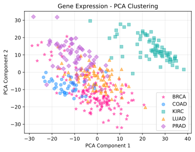
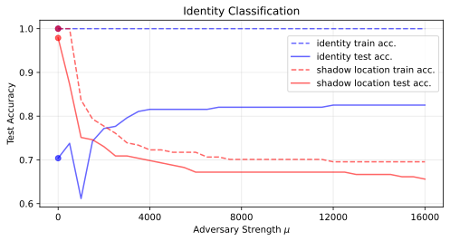

:github_url: https://github.com/wecarsoniv/augmented-pca

.. role:: python(code)
   :language: python

Examples
========================================================================================================================

Here, usage and efficacy of AugmentedPCA models is demonstrated on real world, open-source datasets.

sAPCA Example - Gene Expression Clustering
------------------------------------------------------------------------------------------------------------------------

The ability of sAPCA to create representations with greater class fidelity is demonstrated using a 
`gene expression dataset from the UCI machine learning repository <https://archive.ics.uci.edu/ml/datasets/gene+expression+cancer+RNA-Seq>`_. 
This dataset contains RNA-Seq gene expression samples from patients with five different typesof tumors. Dimensionality 
reduction techniques, such as PCA, are often used in gene expression analysis to visualize clustering of samples in 
2-dimensional(2D) space or as a preprocessing step for downstream classification. However, sometimes principal axes of 
variance may represent patient-specific gene expression variance rather than variance specific to condition or disease. 
Here, sAPCA is used to create representations that, in addition to representing the variance in the gene expression 
data, are aligned with the data labels.

First, Python functions, modules, and libraries used in this example are imported.

.. code-block:: python

    # Import functions, modules, and libraries
    import numpy as np
    from sklearn.preprocessing import LabelEncoder, StandardScaler
    from sklearn.model_selection import train_test_split
    from sklearn.metrics import accuracy_score
    from sklearn.decomposition import PCA
    from sklearn.manifold import TSNE
    from sklearn.linear_model import LogisticRegression
    import matplotlib.pyplot as plt

Next, AugmentedPCA factor models are imported from the :python:`apca.models` module.

.. code-block:: python

    # Import AugmentedPCA models
    from apca.models import *
    

Gene expression data is loaded and formatted into a matrix :python:`X`, where each row represents a different tumor 
gene expression sample and each column represents a different gene. Labels are store in an array and tumor samples are 
assigned an integer label of either 0, 1, 2, 3, or 4. Labels are then one-hot encoded to create a matrix :python:`Y` 
of augmenting supervision data.

.. code-block:: python

    # Display data dimensionality
    print('Cancer gene expression dataset dimensions:')
    print('  Gene expression data:  (%d, %d)' % (X.shape))
    print('  Supervision data:  (%d, %d)' % (Y.shape))
    print('  Labels:  (%d,)' % (y.shape))
    
    >>> Cancer gene expression dataset dimensions:
    >>>   Gene expression data:  (801, 20531)
    >>>   Supervision data:  (801, 5)
    >>>   Labels:  (801,)
    

Instead of using all gene expression data, only a subset of the gene expression data will be used. This is because the 
process of fitting AugmentedPCA models require matrix inversions as well as eigendecompositions. This process gets 
prohibitively expensive for larger feature dimensions. Thus, it is recommended to keep the feature dimensions to around 
~1,000 features, give or take.

Next, scikit-learn's :python:`train_test_split()` function is used to split the data into train and test splits
(roughly 50% and 50% of the data, respectively).

.. code-block:: python

    # Subset of original data
    X_subset = X[:, :2000]

    # Split data
    X_train, X_test, Y_train, Y_test, y_train, y_test = train_test_split(X_subset,
                                                                         Y,
                                                                         y,
                                                                         test_size=0.5,
                                                                         shuffle=True)
    

Gene expression training features are scaled such that each feature has mean zero and unit variance. Then, test data is 
scaled according to the population statistics of the training features. Supervision data isn't scaled since the data is 
one-hot encodings.

.. code-block:: python

    # Instantiate standard scaler
    scaler = StandardScaler()

    # Scale gene expression data
    X_train = scaler.fit_transform(X_train)
    X_test = scaler.transform(X_test)
    

For evaluating the classification performance achieved using AugmentedPCA components, a simple logistic regression 
classifier with no penalty is used, since only two components will be used for prediction.

.. code-block:: python

    # Instantiate logistic regression model
    model = LogisticRegression(penalty='none',
                               solver='lbfgs'
                               max_iter=10000,
                               multi_class='auto')
    

Now, two PCA components of the decomposed gene expression data is used to predict tumor type. Logistic regression only 
achieves 71% accuracy on the test set. This is because PCA finds independent sets  of features (orthogonal components) 
that maximize the explained variance of the data. If the majority of the variance of the gene expression data is not 
aligned with class labels then class separation will not be achieved from the first few principle components. This is 
reflected in the visualization of the 2-dimensional (2D) clustering. There is clear separation of KIRC from the other 
cancers, but the other cancers still have significant overlap.

.. code-block:: python

    # PCA decomposition
    n_components = 2
    pca = PCA(n_components=n_components)
    S_train = pca.fit_transform(X_train)
    S_test = pca.transform(X_test)

    # Fit model to training data
    model.fit(S_train, y_train)

    # Get model predictions
    y_pred_train = model.predict(S_train)
    y_pred_test = model.predict(S_test)
    train_acc = accuracy_score(y_pred_train, y_train)
    test_acc = accuracy_score(y_pred_test, y_test)

    # Model prediction accuracy
    print('Model performance using PCA components (# components = %d):' % (n_components))
    print('  Train set:  %.4f' % (train_acc))
    print('  Test set:  %.4f' % (test_acc))
    
    >>> Model performance using PCA components (# components = 2):
    >>>   Train set:  0.7300
    >>>   Test set:  0.7132

    # Plot PCA components of samples in 2D space
    color_list = ['deeppink', 'dodgerblue', 'lightseagreen', 'darkorange', 'mediumorchid']
    marker_list = ['*', 'o', 's', '^', 'D']
    fig1, ax1 = plt.subplots(nrows=1, ncols=1, figsize=(6.0, 4.5))
    for i, label in enumerate(list(np.unique(y_test))):
        ax1.scatter(S_test[np.where(y_test==label), 0], S_test[np.where(y_test==label), 1],
                    c=color_list[i], marker=marker_list[i], alpha=0.5, label=class_dict[i])
    ax1.set_xlabel('PCA Component 1')
    ax1.set_ylabel('PCA Component 2')
    ax1.grid(alpha=0.3)
    ax1.set_axisbelow(True)
    ax1.legend(loc='lower right')
    plt.show()
    

Now, instead of PCA, sAPCA is used to find components that, in addition to maximizing the explained variance of the 
data, find components that have greater fidelity to class labels. Ideally, this will help separate the different 
clusters of the gene expression data.

Like scikit-learn's PCA implementation, sAPCA models are fit using the :python:`fit()` and :python:`fit_transform()` 
methods, with :python:`fit_transform()` returning a matrix of components or factors. The :python:`fit()` and 
:python:`fit_transform()` methods of AugmentedPCA models require both a primary data matrix :python:`X` and an 
augmenting data matrix :python:`Y` as parameters. For sAPCA models, the augmenting data is the supervision data matrix 
:python:`Y`. In this case, this matrix corresponds to the matrix of one-hot encoded class labels.

AugmentedPCA models have a tuning parameter :python:`mu`, which represents the relative strength of the augmenting 
objective. At lower values of :python:`mu`, AugmentedPCA models will prioritize maximizing explained variance in 
learned components, and this will produce components similar to that produced by regular PCA. At higher values of 
:python:`mu`, the augmenting objective is prioritized. Here, since sAPCA is being used, at higher :python:`mu` values 
the components will have greater clustering according to class.

Since sAPCA has a tuning hyperparameter, we can do a search over the supervision strength space. The magnitude of this 
value will depend on the dataset, the scale of the features, and the dimensionality of the features. Here, a 
supervision strength in the thousands is reasonable. For a smaller number of features, these values may be much too 
large.

AugmentedPCA models offer multiple "approximate inference strategies." For supervised applications of AugmentedPCA, 
it's recommended one often chooses the :python:`'encoded'` option, as done below. Essentially, this ensures that the 
model doesn't need to use the supervision data at test time to create components and instead only relies upon the 
variance explained in the features or primary data matrix :python:`X`.

.. code-block:: python

    # Number of sAPCA components
    n_components = 2

    # List of supervision strength values
    mu_lo = 0.0
    mu_hi = 5000
    mu_step = 100.0
    mu_list = list(np.arange(mu_lo, mu_hi + mu_step, mu_step))

    # Initialize test accuracy list
    train_acc_list = []
    test_acc_list = []

    # Iterate over supervision strengths
    for mu in mu_list:
        # PCA decomposition
        apca = sAPCA(n_components=2, mu=mu, inference='encoded')
        S_train = apca.fit_transform(X=X_train, Y=Y_train)
        S_test = apca.transform(X=X_test, Y=None)

        # Fit model to training data
        model.fit(S_train, y_train)

        # Predict on training data
        y_pred_train = model.predict(S_train)
        train_acc = accuracy_score(y_pred_train, y_train)
        train_acc_list.append(train_acc)

        # Predict on test data
        y_pred_test = model.predict(S_test)
        test_acc = accuracy_score(y_pred_test, y_test)
        test_acc_list.append(test_acc)

    # Model prediction accuracy
    print('Max model performance using sAPCA components (# components = %d):' % (n_components))
    print('  Train set:  %.4f' % (np.max(train_acc_list)))
    print('  Test set:  %.4f' % (np.max(test_acc_list)))
    
    >>> Max model performance using sAPCA components (# components = 2):
    >>>   Train set:  1.0000
    >>>   Test set:  0.9027
    
    # Plot model performance as a function of adversary strength
    fig2, ax2 = plt.subplots(nrows=1, ncols=1, figsize=(8.0, 3.8))
    ax2.plot(mu_list, train_acc_list, c='orangered', linestyle='--', alpha=0.7, label='train acc.')
    ax2.scatter(mu_list[0], train_acc_list[0], c='orangered', alpha=0.7)
    ax2.plot(mu_list, test_acc_list, c='dodgerblue', alpha=0.7, label='test acc.')
    ax2.scatter(mu_list[0], test_acc_list[0], c='dodgerblue', alpha=0.7)
    ax2.set_xlabel('Supervision Strength $\mu$')
    ax2.set_ylabel('Classification Accuracy')
    ax2.grid(alpha=0.3)
    ax2.set_axisbelow(True)
    ax2.legend(loc='lower right')
    plt.show()
    

.. image:: ../_static/img/gene_express_class_pred_docs.svg
    :width: 520
    :align: center
    :alt: gene expression classification

Finally, sAPCA components are visualized in 2D space. There is much greater separation/clustering according to class, 
which demonstrates that sAPCA successfully learned components that both a) maximized explain variance of the original 
gene expression data in learned components and b) made sure these components also had greater fidelity with respects to 
class labels, thus ensuring cleaner clustering according to tumor type.

.. code-block:: python

    # sAPCA decomposition
    apca = sAPCA(n_components=2, mu=2500, inference='encoded')
    S_train = apca.fit_transform(X=X_train, Y=Y_train)
    S_test = apca.transform(X=X_test, Y=None)

    # Plot PCA components of samples in 2D space
    color_list = ['deeppink', 'dodgerblue', 'lightseagreen', 'darkorange', 'mediumorchid']
    marker_list = ['*', 'o', 's', '^', 'D']
    fig3, ax3 = plt.subplots(nrows=1, ncols=1, figsize=(6.0, 4.5))
    for i, label in enumerate(list(np.unique(y_test))):
        ax3.scatter(S_test[np.where(y_test==label), 0], S_test[np.where(y_test==label), 1],
                    c=color_list[i], marker=marker_list[i], alpha=0.5, label=class_dict[i])
    ax3.set_xlabel('sAPCA Component 1')
    ax3.set_ylabel('sAPCA Component 2')
    ax3.grid(alpha=0.3)
    ax3.set_axisbelow(True)
    ax3.legend(loc='lower left')
    plt.show()
    

.. image:: ../_static/img/gene_express_sapca_cluster_docs.svg
    :width: 400
    :align: center
    :alt: gene expression sAPCA clustering

aAPCA Example - Removal of Image Nuisance
------------------------------------------------------------------------------------------------------------------------
    
The ability of aAPCA to create representations invariant to concomitant data or nuisance variables is demonstrated 
using images from the `Extended Yale Face Database B <http://vision.ucsd.edu/~leekc/ExtYaleDatabase/ExtYaleB.html>`_. 
This dataset contains facial images of 38 human subjects taken with the light source at varying angles of azimuth and 
elevation, resulting in shadows cast across subject faces. Here, the nuisance variable is the variable lighting angles 
resulting in shadows that obscure parts of the image, and by extension features of subject identity. Here, aAPCA is 
used to create representations that, in addition to representing the variance in the image data, are invariant to this 
shadow nuisance variable.

First, Python functions, modules, and libraries used in this example are imported.

.. code-block:: python

    # Import functions, modules, and libraries
    import numpy as np
    import matplotlib.pyplot as plt
    import matplotlib.gridspec as gridspec
    from sklearn.model_selection import train_test_split
    from sklearn.metrics import accuracy_score
    from sklearn.decomposition import PCA
    from sklearn.linear_model import LogisticRegression

Next, AugmentedPCA factor models are imported from the :python:`apca.models` module.

.. code-block:: python

    # Import all APCA models
    from apca.models import *

For this example, a subset of 411 images is selected in which only azimuth of the light source is varied (elevation 
remains at a neutral 0 degrees above horizontal) and azimuth angle is not greater than 95 degrees in either direction 
(this avoids angles that result in shadows that completely obscure features of a subject's identity). Images are 
downsampled to 0.25 their original resolution, resulting in images of size 42x48.

Facial images are loaded and formatted into a matrix :python:`X`, where each row represents a flattened image vector,
each column represents a pixel in the image, and an entry in :python:`X` is a pixel intensity for a given image. This 
results in a primary data matrix :python:`X` of size 411x2016. Concomitant data is the azimuth angle of the light 
source, resulting in a concomitant data matrix :python:`Y` of size 411x1. Labels are stored in an array and images are 
assigned an integer label 0, 1, ..., 37.

.. code-block:: python

    # Display dataset dimensions
    print('Yale face dataset dimensions:')
    print('  X shape:  (%d, %d)' % (X.shape))
    print('  Y shape:  (%d, %d)' % (Y.shape))
    print('  labels shape:  (%d,)' % (labels_id.shape))
    
    >>> Yale face dataset dimensions:
    >>>   X shape:  (411, 2016)
    >>>   Y shape:  (411, 1)
    >>>   labels shape:  (411,)
    

Next, scikit-learn's :python:`train_test_split()` function is used to split the data into train and test splits 
(roughly 50% and 50% of the data, respectively). Training image data is scaled to be between 0 and 1 instead of 0 and 
255. Then, test image data is scaled according to the population statistics of the training data. Concomitant data is 
scaled similarly, such that the training concomitant data is scaled to be between and then test concomitant data is 
scaled according to the population statistics of the training concomitant data.

.. code-block:: python

    # Range scaler object
    class RangeScaler():
        # Instantiation method
        def __init__(self, feature_range=(0, 1), copy=True):
            # Assign attributes
            self.feature_range = feature_range
            self.copy = copy
            self.data_min_ = None
            self.data_max_ = None
            self.data_mean_ = None
            self.data_scaled_mean_ = None

        # Fit method
        def fit(self, X, y=None):
            # Extract data min, max, and mean
            self.data_min_ = np.min(X)
            self.data_max_ = np.max(X)
            self.data_mean_ = np.mean(X)

        # Transform method
        def transform(self, X):
            # Deep copy of data
            if self.copy:
                X = X.copy()
            
            # Scale data to be between 0 and 1
            X_scaled = (X - self.data_min_) / (self.data_max_ - self.data_min_)
            X_scaled = (X_scaled * (self.feature_range[1] - self.feature_range[0])) + self.feature_range[0]
            self.data_scaled_mean_ = np.mean(X_scaled)
            
            # Return scaled data
            return X_scaled

        # Fit-transform method
        def fit_transform(self, X, y=None):
            self.fit(X)
            X_scaled = self.transform(X)
            return X_scaled

        # Inverse transform method
        def inverse_transform(self, X, y=None):
            # Deep copy of data
            if self.copy:
                X = X.copy()
            
            # Scale data back to original feature range
            X = (X - self.feature_range[0]) / (self.feature_range[1] - self.feature_range[0])
            X = (X * (self.data_max_ - self.data_min_)) + self.data_min_
            
            # Return inverse-transformed data
            return X

    # Split data
    X_train, X_test, Y_train, Y_test, labels_id_train, labels_id_test, \
    labels_shadow_train, labels_shadow_test = train_test_split(X,
                                                               Y,
                                                               labels_id,
                                                               labels_shadow,
                                                               test_size=0.5,
                                                               shuffle=True)

    # Display split details
    print('Test/train split details:')
    print('  Training samples:  %d' % (X_train.shape[0]))
    print('  Test samples:  %d' % (X_test.shape[0]))
    
    >>> Test/train split details:
    >>>   Training samples:  206
    >>>   Test samples:  206

    # Instantiate scaler objects
    feature_range = (0, 1)
    scaler_X = RangeScaler(feature_range=feature_range, copy=True)
    scaler_Y = RangeScaler(feature_range=feature_range, copy=True)

    # Scale primary data to between 0 and 1
    X_train_scaled = scaler_X.fit_transform(X=X_train)
    X_test_scaled = scaler_X.transform(X=X_test)

    # Scale concomitant data to between 0 and 1
    Y_train_scaled = scaler_Y.fit_transform(X=Y_train)
    Y_test_scaled = scaler_Y.transform(X=Y_test)
    

Now, aAPCA is used to find components that, in addition to maximizing the explained variance of the image data, find 
components that are invariant to shadow/variable lighting condition. Ideally, this will help remove this confound and 
ultimately improve classification performance with respects to classifying identity.

Like scikit-learn's PCA implementation, sAPCA models are fit using the :python:`fit()` and :python:`fit_transform()` 
methods, with :python:`fit_transform()` returning a matrix of components or factors. The :python:`fit()` and 
:python:`fit_transform()` methods of AugmentedPCA models require both a primary data matrix :python:`X` and an 
augmenting data matrix :python:`Y` as parameters. For aAPCA models, the augmenting data is the concomitant data matrix 
:python:`Y`. In this case, this matrix corresponds to the matrix of scaled azimuth lighting angles.

AugmentedPCA models have a tuning parameter :python:`mu`, which represents the relative strength of the augmenting 
objective. At lower values of :python:`mu`, AugmentedPCA models will prioritize maximizing explained variance in 
learned components, and this will produce components similar to that produced by regular PCA. At higher values of 
:python:`mu`, the augmenting objective is prioritized. Here, since aAPCA is being used, at higher :python:`mu` values 
the components will have greater invariance to the shadow confound.

Since aAPCA has a tuning hyperparameter, we can do a search over the supervision strength space. The magnitude of this 
value will depend on the dataset, the scale of the features, and the dimensionality of the features. Here, a 
supervision strength in the thousands is reasonable. For a smaller number of features, these values may be much too 
large.

AugmentedPCA models offer multiple "approximate inference strategies." For adversarial applications of AugmentedPCA, 
the :python:`'local'` option is commonly chosen, as done below. This is because typically one has access to both 
primary data and concomitant data at test time.

.. code-block:: python

    # Number of components
    n_components = 100

    # Adversary strength list
    mu_lo = 0.0
    mu_hi = 16000.0
    mu_step = 500.0
    mu_list = list(np.arange(mu_lo, mu_hi + mu_step, mu_step))

    # Initialize and instantiate
    scaler_S = StandardScaler()
    model = LogisticRegression(penalty='none',
                               solver='lbfgs',
                               max_iter=100000)
    id_train_acc_list = []
    id_test_acc_list = []
    shadow_train_acc_list = []
    shadow_test_acc_list = []

    # Data prediction
    model.fit(X_train_scaled, labels_id_train)
    y_pred = model.predict(X_test_scaled)
    test_acc = accuracy_score(y_true=labels_id_test, y_pred=y_pred)
    print('Logistic regression on orginal image data:  %.3f' % (test_acc))
    
    >>> Logistic regression classification peformance on orginal image data:  0.636

    # Iterate over increasing adversary strengths
    for mu in tqdm(mu_list):
        # Instantiate APCA model with new adversary strength value
        aapca = aAPCA(n_components=n_components, mu=mu, inference='joint')

        # Decompose with APCA
        S_train = aapca.fit_transform(X=X_train_scaled, Y=Y_train_scaled)
        S_test = aapca.transform(X=X_test_scaled, Y=Y_test_scaled)
        S_train_scaled = scaler_S.fit_transform(S_train)
        S_test_scaled = scaler_S.transform(S_test)

        # Predict ID
        model.fit(S_train_scaled, labels_id_train)
        y_pred_train = model.predict(S_train_scaled)
        train_acc = accuracy_score(y_true=labels_id_train, y_pred=y_pred_train)
        id_train_acc_list.append(train_acc)
        y_pred_test = model.predict(S_test_scaled)
        test_acc = accuracy_score(y_true=labels_id_test, y_pred=y_pred_test)
        id_test_acc_list.append(test_acc)

        # Predict shadow location
        no_shadow_idx_train = np.where(labels_shadow_train!=0.5)[0].ravel()
        no_shadow_idx_test = np.where(labels_shadow_test!=0.5)[0].ravel()
        model.fit(S_train_scaled[no_shadow_idx_train, :],
                  labels_shadow_train[no_shadow_idx_train])
        y_pred_train = model.predict(S_train_scaled[no_shadow_idx_train, :])
        train_acc = accuracy_score(y_true=labels_shadow_train[no_shadow_idx_train],
                                   y_pred=y_pred_train)
        shadow_train_acc_list.append(train_acc)
        y_pred_test = model.predict(S_test_scaled[no_shadow_idx_test, :])
        test_acc = accuracy_score(y_true=labels_shadow_test[no_shadow_idx_test],
                                  y_pred=y_pred_test)
        shadow_test_acc_list.append(test_acc)

    # Display baseline PCA accuracy and max APCA accuracy
    print('Logistic regression classification performance:')
    print('  ID classification:')
    print('    PCA components:  %.3f' % (id_test_acc_list[0]))
    print('    APCA components (max acc.):  %.3f\n' % (np.max(id_test_acc_list)))
    print('  Shadow location (left/right) classification:')
    print('    PCA components:  %.3f' % (shadow_test_acc_list[0]))
    print('    APCA components (min acc.):  %.3f\n' % (np.min(shadow_test_acc_list)))
    
    >>> Logistic regression classification performance:
    >>>   ID classification:
    >>>     PCA components:  0.704
    >>>     APCA components (max acc.):  0.825
    >>>   Shadow location (left/right) classification:
    >>>     PCA components:  0.979
    >>>     APCA components (min acc.):  0.656
    

Model performance when using shadow-invariant aAPCA components to classify identity and shadow location as a function 
of adversary strength is now plotted. As the adversarial strength is increased, both training and test set 
classification accuracy of the nuisance variable (shadow location) decreases. For all adversary strengths, training set 
identity classification is 100%. Initially, training on PCA representations results in a test set identity 
classification accuracy of 70%. As adversary strength is increased, test set identity classification accuracy increases 
to 82%, thus demonstrating the ability of aAPCA to mitigate the effects of domain shift due to concomitant influence.

.. code-block:: python

    # Plot accuracy as a function of adversary strength
    fig1, ax1 = plt.subplots(nrows=1, ncols=1, figsize=(8.0, 3.8))
    ax1.plot(mu_list, id_train_acc_list, c='blue', linestyle='--', alpha=0.6, label='identity train acc.')
    ax1.scatter(mu_list[0], id_train_acc_list[0], c='blue', alpha=0.6)
    ax1.plot(mu_list, id_test_acc_list, c='blue', linestyle='-', alpha=0.6, label='identity test acc.')
    ax1.scatter(mu_list[0], id_test_acc_list[0], c='blue', alpha=0.6)
    ax1.plot(mu_list, shadow_train_acc_list, c='red', linestyle='--', alpha=0.6, label='shadow location train acc.')
    ax1.scatter(mu_list[0], shadow_train_acc_list[0], c='red', alpha=0.6)
    ax1.plot(mu_list, shadow_test_acc_list, c='red', linestyle='-', alpha=0.6, label='shadow location test acc.')
    ax1.scatter(mu_list[0], shadow_test_acc_list[0], c='red', alpha=0.6)
    ax1.set_xticks([0, 4000, 8000, 12000, 16000])
    ax1.set_yticks([0.60, 0.70, 0.80, 0.90, 1.00])
    ax1.set_title('Identity Classification')
    ax1.set_xlabel('Adversary Strength $\mu$')
    ax1.set_ylabel('Test Accuracy')
    ax1.grid(alpha=0.3)
    ax1.set_axisbelow(True)
    ax1.legend(loc='upper right', bbox_to_anchor=(1.0, 0.94))
    plt.show()
    

Since AugmentedPCA models are linear factor models similar to PCA, both the primary and concomitant data can be 
reconstructed from the generated components. AugmentedPCA models have a :python:`reconstruct()` method that 
returns the reconstructed primary and concomitant data. For this example, the shadow-invariant images reconstructed 
from aAPCA components are visualized and compare these images to the original images as well as images recontructed 
from regular PCA components. aAPCA  reconstructions  display  notice-able shadow removal when compared to the original 
images and images reconstructed from PCA components. This demonstrates aAPCA’s ability to produce nuisance-invariant 
representations.

.. image:: ../_static/img/yale_face_recon_supp_docs.svg
    :width: 700
    :align: center
    :alt: Yale Face dataset image reconstructions

Finally, clustering of aAPCA-reconstructed images is compared to clustering of PCA-reconstructed images. PCA
reconstructions are grouped almost exclusively according to  shadow  location (left-side or right-side) in 2D space, 
while aAPCA-reconstructed images are grouped in a more shadow-invariant manner.

.. image:: ../_static/img/yale_face_tsne_cluster_docs.svg
    :width: 600
    :align: center
    :alt: Yale Face dataset image reconstruction t-SNE clustering

