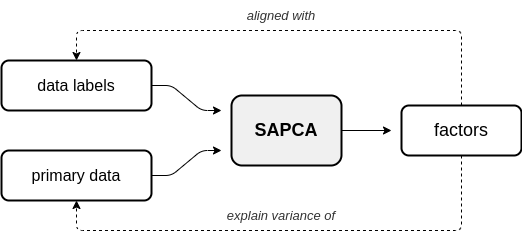
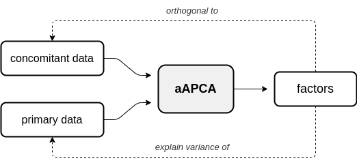
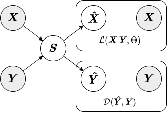

:github_url: https://github.com/wecarsoniv/augmented-pca 

.. role:: python(code)
   :language: python

Models
======

In this section, a more detailed description of the offered APCA models and inference strategies is provided.

Supervised APCA
~~~~~~~~~~~~~~~

In supervised APCA (sAPCA), the augmenting objective is to make the factors *aligned* with the data labels, or some outcome, in addition to having the factors explain the variance of the original observed or primary data. Below is a diagram depicting the relationship between primary data, supervision data, and the resulting sAPCA factors.

Adversarial APCA
----------------

In adversarial APCA (aAPCA), the augmenting objective is to make the factors *orthogonal* to a set of concomitant data, in addition to having the factors explain the variance of the original observed or primary data. Below is a diagram depicting the relationship between primary data, concomitant data, and the resulting aAPCA factors.

Approximate Inference Strategies
--------------------------------

In this section, we give a brief overview of the different approximate inference strategies offered for APCA. Inference 
strategy should be chosen based on the data on which the APCA model will be used as well as the specific use case. Both 
aAPCA and sAPCA models use the jointly-encoded approximate inference strategy by default.

Local
~~~~~

In the local approximate inference strategy, the factors (local variables associated with each observation) are 
included in both the likelihood relating and the augmenting objective. Below is a diagram from our paper depicting the 
local inference strategy.

.. image:: ../_static/img/local_inference_diagram.png
    :alt: local inference diagram

Because the local variables are included in the augmenting objective, given new data we must have both primary *and* 
augmenting data to obtain factors. Thus, the local inference strategy should only be used for inference on new data
when both primary and augmenting data are available. Below we show an example of how to fit a sAPCA model with local
approximate inference strategy to training data and obtain factors for test data.

.. code-block:: python
    
    # Import numpy
    import numpy as np
    
    # Import supervised APCA
    from apca.models import sAPCA
    
    # Generate synthetic data and labels
    n_samp = 100
    X = np.random.randn(n_samp, 20)
    Y = np.random.randint(low=0, high=1, size=(n_samp, 1), dtype=int)
    
    # Generate test/train splits
    train_pct = 0.7
    idx = np.arange(start=0, stop=101, step=1, dtype=int)
    np.random.shuffle(idx)
    n_train = int(train_pct * len(idx))
    train_idx = idx[:n_train]
    test_idx = idx[n_train:]
    
    # Split data into test/train sets
    X_train = X[train_idx, :]
    X_test = X[test_idx, :]
    Y_train = Y[train_idx, :]
    Y_test = Y[test_idx, :]
    
    # Instantiate supervised APCA model with local approximate inference strategy
    sapca = sAPCA(n_components=3, mu=5.0, inference='local')
    
    # Fit supervised APCA model
    sapca.fit(X=X_train, Y_train)
    
    # Generate components for test set
    # Note: both primary and augmenting data are needed to obtain factors
    S_test = sapca.transform(X=X_test, Y=Y_test)
    

Note that when factors are generated for the test set that the :python:`transform()` method requires both the primary 
data :python:`X_test` and labels :python:`Y_test` be passed as parameters. For a more in-depth description of the local 
approximate inference strategy, see our paper or the corresponding 
`documentation section <https://augmented-pca.readthedocs.io/en/latest/index.html>`_.

Encoded
~~~~~~~~~~~~~~~~~~~~~~~~~~~~~~~~~~~~~~~~~~~~~~~~~~~~~~~~~~~~~~~~~~~~~~~~~~~~~~~~~~~~~~~~~~~~~~~~~~~~~~~~~~~~~~~~~~~~~~~~

In the encoded approximate inference strategy, a linear encoder is used to transform the data into factors or 
components. This inference strategy is termed "encoded" because the augmenting objective is enforced via the encoder. 
Below is a diagram depicting the encoded inference strategy.

.. image:: ../_static/img/encoded_inference_diagram.png
    :alt: encoded inference diagram

In contrast to the local inference strategy, when factors are generated for the test set under the encoded inference 
strategy the :python:`transform()` method only requires the primary data :python:`X_test`. Below we show an example of 
how to fit a sAPCA model with encoded approximate inference strategy to training data and obtain factors for test data.

.. code-block:: python
    
    # Instantiate supervised APCA model model with encoded approximate inference strategy
    sapca = sAPCA(n_components=3, mu=5.0, inference='encoded')
    
    # Fit supervised APCA model
    # Note: both primary and augmenting data are required to fit the model
    sapca.fit(X=X_train, Y_train)
    
    # Generate components for test set
    # Note: only primary data are needed to obtain factors
    S_test = sapca.transform(X=X_test)
    

For a more in-depth description of the encoded approximate inference strategy, see our paper or the corresponding 
`documentation section <https://augmented-pca.readthedocs.io/en/latest/index.html>`_.

Jointly-Encoded
~~~~~~~~~~~~~~~~~~~~~~~~~~~~~~~~~~~~~~~~~~~~~~~~~~~~~~~~~~~~~~~~~~~~~~~~~~~~~~~~~~~~~~~~~~~~~~~~~~~~~~~~~~~~~~~~~~~~~~~~

The jointly-encoded approximate inference strategy is similar to the encoded in that the augmenting objective is 
enforced through a linear encoding matrix. However, in the jointly-encoded inference strategy both the primary and 
augmenting data are required for computing factors, similar to the local inference strategy. Below is a diagram 
depicting the jointly-encoded inference strategy.

Similar to the local inference strategy, when factors are generated for the test set under the jointly-encoded
inference strategy the :python:`transform()` method requires both the primary data :python:`X_test` and augmenting data 
:python:`Y_test`. Below we show an example of how to fit a sAPCA model with jointly-encoded approximate inference
strategy to training data and obtain factors for test data.

.. code-block:: python
    
    # Instantiate supervised APCA model model with encoded approximate inference strategy
    sapca = sAPCA(n_components=3, mu=5.0, inference='joint')
    
    # Fit supervised APCA model
    # Note: both primary and augmenting data are required to fit the model
    sapca.fit(X=X_train, Y_train)
    
    # Generate components for test set
    # Note: both primary and augmenting data are needed to obtain factors
    S_test = sapca.transform(X=X_test, Y=Y_test)
    

For a more in-depth description of the jointly-encoded approximate inference strategy, see our paper or the 
corresponding `documentation section <https://augmented-pca.readthedocs.io/en/latest/index.html>`_.

